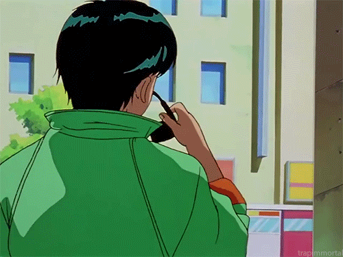

  
  
  <h1>Olá! 👋 Sou José Brito</h1>
  
  

    <strong>Desenvolvedor Full-Stack</strong> & <strong>Cientista de Dados</strong> 
    Apaixonado por tecnologia, IA e impacto social.
  

---

### 🚀 Em Busca de Soluções Criativas

Atualmente, **focado em aplicar tecnologia para resolver desafios no setor público**, com especial interesse em **eficiência digital** e **impacto social**. Estou explorando ativamente o potencial de **Machine Learning** e **microserviços**.

---

### 🛠️ Minhas Competências Técnicas

   
  
    
  
    
  
    
  
   

---

### 📊 Insights do Meu GitHub

  
  

---

### 🤝 Conecte-se Comigo

  
  

